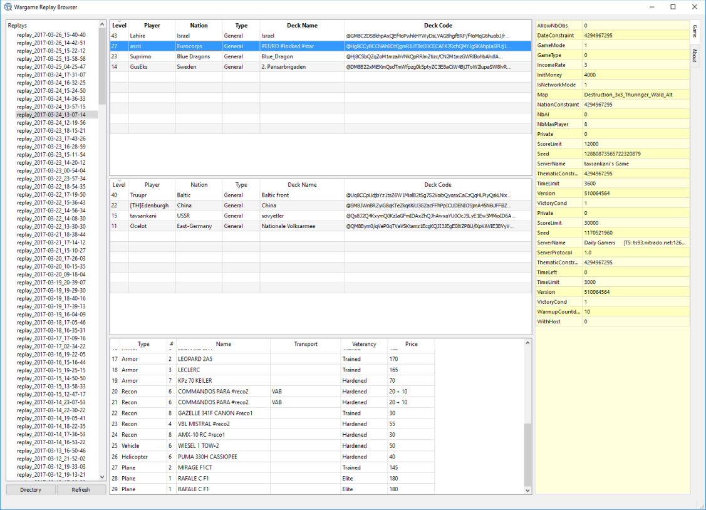

qReplay
=====

qReplay is an offline replay browser for Wargame Red Dragon. It will show what deck is used by players by parsing replay files.

Requirements
-----
 -  Visual C++ Redistributable Packages for Visual Studio 2015 (included in the zip file)

Downloads
-----

https://github.com/ascii78/qReplay/releases